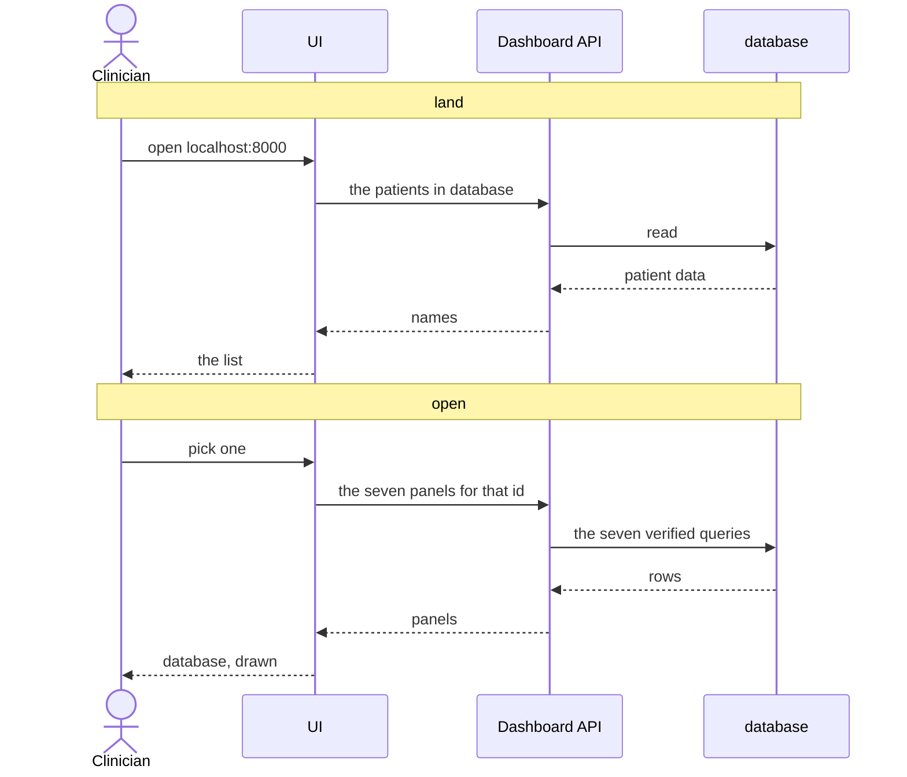
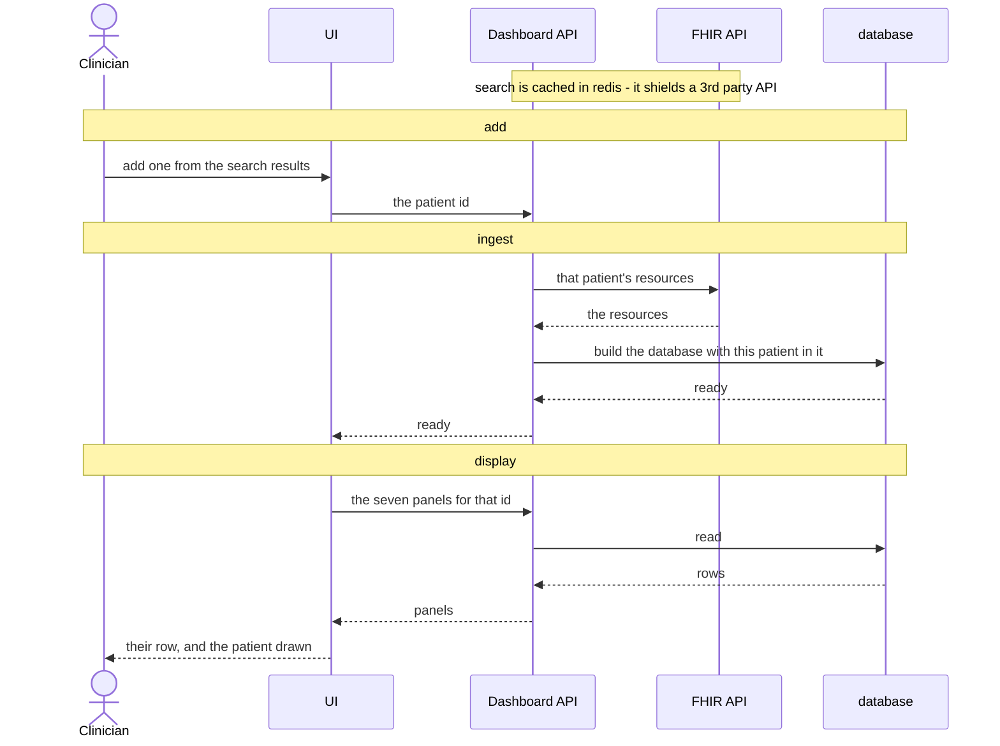

# FHIR Patient Summary

A dashboard over a sample of FHIR data: the patients **database** holds a list of sample data, which is presented on the UI for a user to view.
Each patient's data represent a summary view of that synthesises information from multiple FHIR resource types, which aims for easy to understand.

## How to Run

### Full Docker

- `git clone git@github.com:mingzilla/fhir_patient_summary.git`
- `docker compose up -d`
- access `http://localhost:8000`

### Dev Mode

- `./start.sh`
- access `http://localhost:8021`
- `./stop.sh` to stop it

## What it shows

## How it Works

## Data Ingesting and Display

## Full Analytical Procedure

[full_analytical_procedure.md](data_analysis/full_analytical_procedure.md)