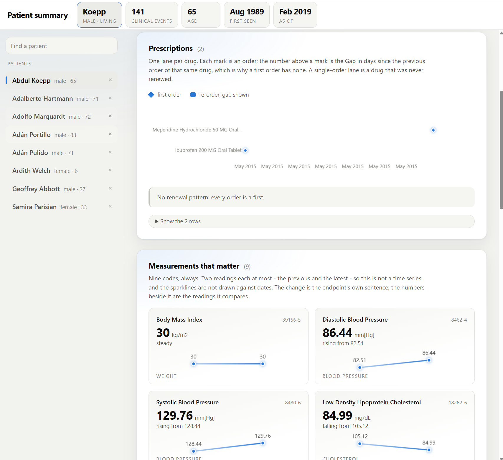
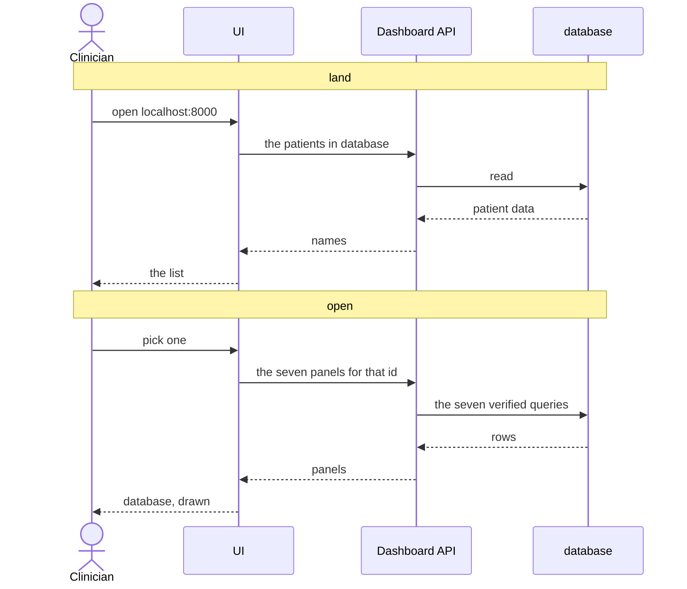
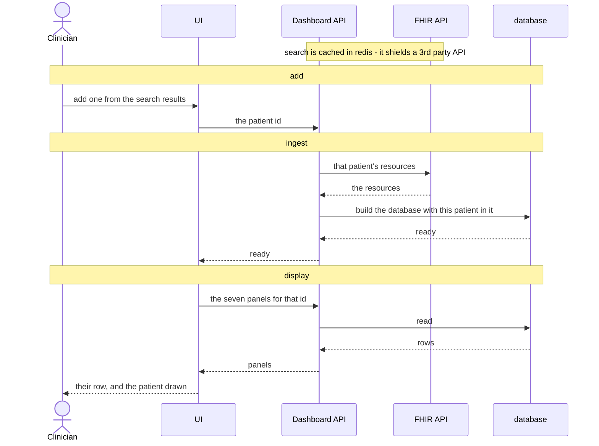
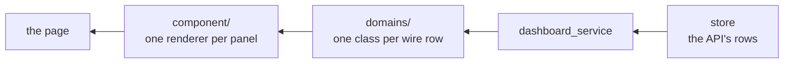

# FHIR Patient Summary

A dashboard over a sample of FHIR data: the patients **database** holds a list of sample data, which is presented on the UI for a user to view.
Each patient's data represent a summary view of that synthesises information from multiple FHIR resource types, which aims for easy to understand.

## How to Run

### Docker (and Windows)

- `git clone git@github.com:mingzilla/fhir_patient_summary.git`
- `docker compose up -d`
- access `http://localhost:8000`

### Dev Mode

- `./start.sh`
- access `http://localhost:8021`
- `./stop.sh` to stop it

POSIX only - both scripts are `sh`. On Windows, use Docker above or WSL.

## What it shows

## Deliverable

- 5 examples in - PDF print from the UI: [example_outputs](docs/example_outputs)

## How it Works

## Data Ingesting and Display

## UI Design and Frontend

The screen is derived from the data: the resource inventory decided what could be shown, and each
panel's wire shape decided how.

| | |
|---|---|
| **DDD** | a panel is a domain object rendered, not an index into JSON. A field keeps one name from SQL to the component: `patient-search__input` |
| **BEM** | `block__element--modifier`. A block never styles another block's elements, so a panel moves without a stylesheet change |

## Technology Choices

| Choice | Why |
|---|---|
| **Vanilla JS, no build** | ES modules the browser loads directly. `package.json` is there for `node --test`, not a bundler |
| **FastAPI, one route per panel** | the response is the panel's rows verbatim, so the API's shape is the report's shape |
| **Redis, in front of search only** | search is the only route that leaves this system. Measured: a cold query is 829 ms and one FHIR request, the repeat 11 ms and none. Best-effort - if it is down, search still answers |
| **DuckDB, one file** | analytical SQL over one flat table per resource type, which is what a column store is for. It is also a *file*: built beside itself and renamed over, so a rebuild never blocks a reader |
| **Panels as `.sql`, not Python** | the verified artifact is the query, so the page runs the text the report was verified against - and where there are two copies, a test holds them equal |

The stages, the loops and what each proved are in
[Full Analytical Procedure](data_analysis/full_analytical_procedure.md).

## Assumptions and Limitations

**Assumption.** This is the record analysed and presented, not a clinical tool in a consultation
- no workflow, no write-back, no live sync. Everything below follows from that.

| | |
|---|---|
| **Timestamps take the machine's timezone** | FHIR datetimes carry an offset; the tables store none, so the conversion goes through the session timezone. `1989-08-05T19:37:54-04:00` is `1989-08-06 00:37:54` under `Europe/London` and `1989-08-05 23:37:54` under `UTC` - reproducible on a machine configured like this one, and not otherwise |
| **A loaded patient is never refreshed** | the rows are a snapshot of when they were fetched, and re-adding answers `ready` without asking the server. The only refresh is a full rebuild |
| **The record ships with seven patients** | search reaches any patient the FHIR server holds; adding one puts them in the database |
| **No authentication** | no gate on the app. Fine on a laptop; a public deployment would need one first |
| **Load balancing is out of scope** | one instance serves the page and the API from a local file. Nothing is shared, so there is nothing to balance |
| **GDPR compliance is out of scope** | the database holds raw patient rows and the cache holds names, both unencrypted. Meeting it would change the *design*, not the deployment: encryption at rest under a key we manage, or not persisting the raw record at all |
| **Search and add need the FHIR server** | it takes about three minutes to answer after a cold start. Until then `/search` answers `503`, not an empty list |

## Full Analytical Procedure

[full_analytical_procedure.md](data_analysis/full_analytical_procedure.md)