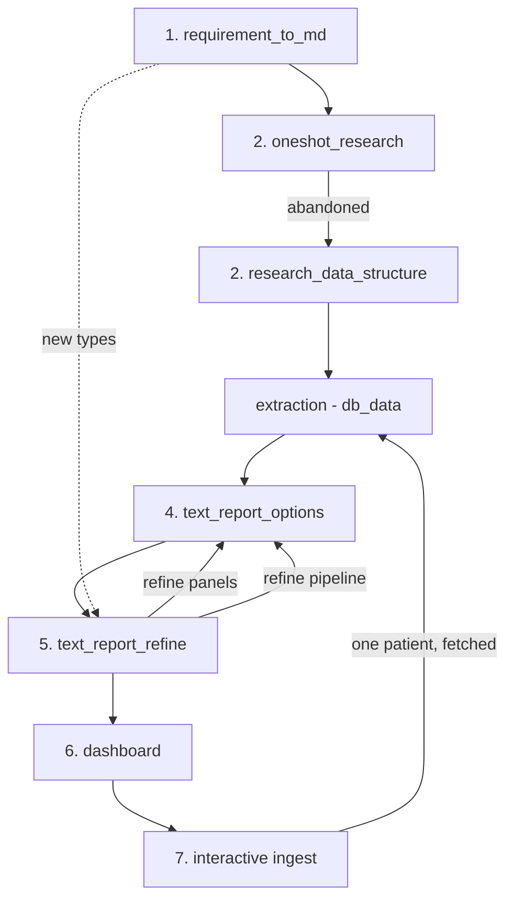

# Procedure

## Overview

| Stage | Folder | Input | Output |
|---|---|---|---|
| 1 Requirement to MD | `stage_01__requirement_to_md` | the brief, the FHIR server | the taxonomy, and what the server holds |
| 2 One-shot research | `stage_02__oneshot_research` | one patient's record | a model-written summary - abandoned |
| 2 Research data structure | `stage_02__research_data_structure` | the FHIR server | resource types, volumes, the whitelist |
| Extraction | `db_data/` | API responses, by patient | `fhir_sample.duckdb` |
| 4 Text report options | `stage_04__text_report_options` | the database | panels: `.sql` + `.txt` + `report.md` |
| 5 Text report refine | `stage_05__text_report_refine` | a text report | better panels, holding across record shapes |
| 6 Dashboard | `stage_06__dashboard` | the proven panels | an interactive view |
| 7 Interactive ingest | `src/`, `db_data/` | a patient on the FHIR server | that patient in the database, and the panels for them |

Two stages share the number 2 and there is no stage 3: the extraction that followed the research
moved to `db_data/`, beside the database it builds and the schema it reads, rather than sitting in
a stage of its own. The stage numbers are the folder numbers, so a number in this document can be
found on disk - except for the two that have no folder: the extraction, and the interactive ingest
that grew out of it and lives in `src/`.

## Stage 1 — Requirement to MD and Taxonomy Research

**Goal.** Get familiar with the domain. Make sure code is developed based on standard terminology.

## Stage 2 — One-shot Research

**Goal.** Let LLM create a summary see what it can produce.

- **Result**: failed because it took too long and could not finish.

## Stage 2 — Research Data Structure

**Goal.** Find what the server holds before deciding what to read. Prepare to mirror data for Stage 3.

| Action | Output |
|---|---|
| List resource types | the full set the server exposes |
| Count each type per patient | volume per type |
| Inspect one of each | field names, cardinalities, which are optional |
| Identify clinical vs. non-clinical | the whitelist boundary |

**Deliverable.** A resource inventory: type, rows per patient, clinical or not, read or not.

## Stage 3 - Extraction — `db_data/`

**Goal.** Turn API responses into something that can be aggregated.

| Action | Output |
|---|---|
| Fetch each resource type per patient | raw JSON |
| Flatten to one table per type | `observation`, `condition`, … |
| One row per resource | aggregation is a `GROUP BY` away |
| Keep ids | every row traceable back to the source |

**Deliverable.** `fhir_sample.duckdb` — one table per resource type, keyed by patient.

## Stage 4 — Text report options

**Goal.** A report per patient that synthesises several resource types.

| Action | Output |
|---|---|
| One `.sql` per panel | a query, `.mode markdown` |
| One `.txt` per panel | the query's output, verbatim |
| Assemble into `report.md` | panels in reading order |
| One `SET VARIABLE pid` per panel | the only patient-specific line |

**Deliverable.** A report made of tables, each recreatable from its `.sql`.

## Stage 5 — Text report refine

**Goal.** Two loops, not one.

### 5a — Refine panels

| Question | Action |
|---|---|
| Which panels earn their place? | drop, merge, reorder |
| Which rows are noise? | aggregate, filter, rank |
| Which audience is served? | clinician / auditor / orienting reader |

### 5b — Refine pipeline

| Question | Action |
|---|---|
| Is every sort total? | unique-column tiebreaker everywhere |
| Is every row traceable? | `Source` column on every panel |
| Is every derived value derived? | no hardcoded patient data outside `pid` |
| Does every number cross-check? | reconcile panels against each other |
| Is the output stable? | re-run and diff before advancing |

### 5c — Different data

**Goal.** Test the pipeline against record shapes it has not seen.

| Test | What it exercises |
|---|---|
| A living patient | `Died`, `Age` for the living |
| A patient with no billing | empty-type handling |
| A patient with one reading per code | `Previous` NULL path |
| A patient with no conditions | empty panel |
| A patient with a single event | degenerate span |
| All sample patients | cross-patient stability |

| Assumption to test | Breaks when |
|---|---|
| Ids sort numerically | ids are strings |
| Every type has rows | a type is empty |
| Two readings per key code | only one reading |
| Resolution carries a date | resolved without abatement |

**Deliverable.** Fewer, better panels; a pipeline that is deterministic and traceable, and holds
across every patient in the sample.

## Stage 6 — Dashboard

**Goal.** Render the proven panels as a view.

| Action | Output |
|---|---|
| One tab per resource type | empty tabs inert |
| Panel per tab | same queries as stage 4 |
| Provenance on every row | `Source` carried through |
| Patient strip pinned | subject always visible |

**Deliverable.** An interactive view whose tables are the stage-4 queries.

## Stage 7 — Interactive ingest

**Goal.** The ingest stops being a batch run by hand and becomes something the reader drives.

| Action | Output |
|---|---|
| Search the FHIR server, from the page | candidates, none of them in the database yet |
| Add one | that patient fetched, and the database rebuilt with them in it |
| Remove one | the database rebuilt without them |
| Build on first start | a database from the seed, when there is none |

Three things are what made this a stage rather than a screen.

| | |
|---|---|
| **The database is rebuilt, not written into** | it is built beside itself and renamed over, so the panels keep answering while a patient is being fetched. An insert would take the one writer DuckDB allows and stop every reader |
| **A patient the page has not added is not in the database** | which is why the search asks the FHIR server and not the database, and why the two answers - candidates, and the list on the left - are joined by id rather than by name |
| **A code is not a number** | the types the schema inferred from seven patients are not the types an eighth patient's data can be relied on to fit, and the samples were chosen so that they do not |

**Deliverable, verified.** Searching, adding and removing, driven from the page, with the database
built from the seed when there is none: `api -> script -> database` is the only path, and the seed
exists so that a deployment has something to serve before anything is fetched.

## Loop structure

| Loop | Repeats | Exits when |
|---|---|---|
| Inner — panels | 4 ↔ 5a | panels answer the brief |
| Middle — pipeline | 4 ↔ 5b | deterministic, traceable, reconciled |
| Outer — patients | 4 ↔ 5c | holds across every record shape |

## Verification gate

Before advancing a stage:

| Gate | Check |
|---|---|
| Stage 4 → 5 | every panel runs; every `.txt` matches its `.sql` |
| Stage 5 → 6 | three consecutive runs agree with the saved `.txt` |
| Stage 5c → 6 | every sample patient produces a report without error |

## Stage map

| Stage | Produces | Feeds |
|---|---|---|
| 1 requirement | taxonomy, inventory | 2 |
| 2 research | the whitelist, the data model | extraction |
| extraction | DuckDB | 4 |
| 4 panels | report | 5, 6 |
| 5 refine | better panels, better SQL | 4 |
| 6 dashboard | interactive view | 7 |
| 7 interactive ingest | a database that grows from the page | 4 |
