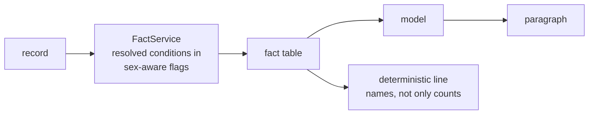
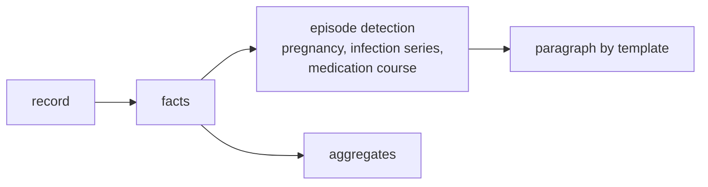
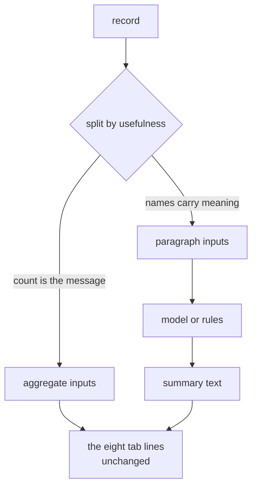

# What to do about the summary

| Date | Author | Evidence |
|---|---|---|
| 2026-09-24 | aire__john | live server, patient 35365 (Chau Anderson) and 1643; `_docs/fhir_sample_data/raw` |

You are right that the page you pasted is not a summary. This is what I found measuring it, what
the data says about the idea of using the record's own prose, which resources actually earn their
place, and three options.

---

## 1. What you were looking at

**The output you pasted is the no-model path.** `0 active problems and 0 current prescriptions.
18 measurements over 71 readings from 2009-09-03 to 2018-12-03…` is `FactService.overview`
verbatim — the fallback that composes a paragraph from the counts when no model is configured.
It is not what the model writes; it is what the model writes *instead of*.

That fallback is mine and it is two days old. It replaced *"no narrative summary is available for
this record"*, which was worse, and it is a table read aloud. **A table read aloud is still a
table**, and your instinct that it adds nothing over a `GROUP BY` is exactly right.

**The model path produces something different, and I did not expect it to be this much better.**
Same patient, same facts, one call:

> **Procedure** — 34 completed procedures from 2009-12-16 to 2017-12-28, among them counseling and
> induced termination of pregnancy (2013-01-10), pregnancy termination care (2013-01-24),
> **childbirth** (2013-11-21), prenatal screening and antibody tests, fetal heart auscultation and
> depression screening.
>
> **Encounter** — Eight finished visits… including an **obstetric emergency hospital admission**
> (2013-11-21), childbirth-related postnatal care, prenatal visits…
>
> **MedicationRequest** — Four prescriptions, all stopped: Yaz 28 Day Pack (2009-09-03)…
> Jolivette 28 Day Pack (2014-12-28) and Levora 0.15/30 28 Day Pack (2017-12-12) — every one of
> them stopped.
>
> **overview** — 31-year-old female with no recorded problems and no recorded allergies; all four
> prescriptions are stopped, hemoglobin is low and oral temperature is high, and the most recent
> visit (for a symptom, 2018-12-03) has nothing recorded after it.

It found the pregnancy, the obstetric admission and the contraceptive sequence in a record whose
conditions list reads "0 active". So **the answer to "is the LLM the right solution" is not the
one either of us expected**: the model is doing real work here, and what you saw was its absence.

## 2. But three real defects are visible in that same output

Each is measured, not inferred.

| # | Defect | Evidence |
|---|---|---|
| 1 | **Resolved conditions are dropped entirely** | 7 conditions in the record → **0** in the fact table. The model was given nothing about two pregnancies or five respiratory infections, so it wrote *"no recorded problems"* — the single most misleading sentence it could produce for this patient |
| 2 | **The thresholds are sex-blind** | Hemoglobin 718-7 is configured `(13.5, 17.5)` — the **adult male** range. For this female patient, 12.6 g/dL was flagged **"low"** when the female range is about 12.0–15.5. A false positive in a clinical summary, and the fastest way to lose a clinician's trust |
| 3 | **A count destroys a pattern** | 58 procedures became `58 procedures`. Among them: 8× fundal height, 8× fetal heart auscultation, 2× fetal ultrasound. That is **two pregnancies**, and the aggregate says nothing |

Defect 3 is the same shape as your complaint, and it is worth stating precisely: **the collapse
groups by resource type, which is the shape of the database, not the shape of the patient.**

## 3. The record's own prose — checked, and it is not there

You suggested there may be usable paragraphs in the source. I looked, because it would be the best
answer if true.

| Candidate | Measured |
|---|---|
| `DiagnosticReport.conclusion` | **0 of 64** reports carry one |
| `Resource.text` (FHIR's narrative) | On the Patient it is *"Generated by Synthea. Version identifier: v2.4.0-100-g26a4b936…"*; on Conditions it is **absent**. It is a generator banner, not a narrative |
| `observation.value_codeable_text` | Real but short — `"Never smoker"`, `"Former smoker"`. Useful as a value, not as prose |

**There is no paragraph in this data to reuse.** The narratives that exist are either empty or
Synthea describing itself. So "use the source prose" is answered, and the options below are about
what we *compute*.

## 4. Which resources earn their place

You asked which resources are useful for this purpose. Ranking them by what they actually
contributed to the good output above, and by what a clinician reads a record for:

| Resource | Verdict | Why |
|---|---|---|
| **Procedure** | **Essential** | Carried the entire pregnancy story. The names are the signal — `Auscultation of the fetal heart ×8` means something a count cannot say |
| **Condition** | **Essential — and currently broken** | The problem list is what a clinician reads first. Dropping resolved ones empties it for exactly the patients who are well |
| **Observation** | **Essential** | The only source of "is anything wrong right now" — but only with correct thresholds (defect 2) |
| **MedicationRequest** | **High** | The sequence and the *stopped* status told the contraceptive story. Names plus dates, not a count |
| **Encounter** | **Medium-high** | Types carry care context — *obstetric emergency*, *postnatal* — that no other resource states |
| **AllergyIntolerance** | **High when present** | Safety-critical, and cheap: the whole message is one line. Absent for this patient, which is itself a finding |
| **Immunization** | **Low** | "Up to date for age" is the entire message. A count is sufficient; the individual doses are not |
| **DiagnosticReport** | **Low here** | 1 report with no conclusion. It was valuable for 1643 only because panels group results — as a *grouping*, not as a finding |

The dividing line: **resources whose *names* carry meaning belong in the paragraph; resources whose
*count* is the whole message belong in an aggregate.** Procedures, conditions, medications and
encounters are the first kind. Immunizations are the second.

---

## 5. The options

### Option A — Keep the model; fix what the facts drop

Three targeted changes to `FactService`, no architectural change:

1. **Include resolved conditions**, with their resolution date and status. A problem list that
   empties itself for healthy patients is the wrong way round.
2. **Make the threshold table sex-aware** — hemoglobin, hematocrit and anything else whose normal
   range is sex-specific.
3. **Let the procedure section keep its shape** — the per-code rows already carry `readings`, so
   `Auscultation of the fetal heart, 8 readings` is discoverable. The defect is the *deterministic
   line* throwing that away, not the facts.

| | |
|---|---|
| **Cost** | Small. Three localized changes, each with a test |
| **Buys** | The model stops saying "no recorded problems"; no false-positive flags; the fallback stops being a bare table |
| **Risk** | Low. The collapse rule and the wire contract are untouched |
| **Evidence it works** | Re-run 35365 and check the Condition line exists and the hemoglobin flag is gone |

### Option B — Drop the model; invest in the deterministic paragraph

Everything the reader sees is computed. The model is removed from the design rather than fixed.

| | |
|---|---|
| **Cost** | High. The rules *are* the intelligence — detecting "two pregnancies" from procedure clusters, "recurrent respiratory infection" from a condition series |
| **Buys** | Deterministic, auditable, no PHI leaving, no budget/timeout/reasoning-token/routing problems. Identical output for every clinician by construction |
| **Risk** | High and permanent: every pattern must be anticipated, and an unanticipated one is invisible rather than merely unpolished |
| **Honest note** | This is *what the deterministic path already is*, done badly. Option A improves it as a side effect; B is the decision to make it the whole product |

### Option C — Re-scope the projection: fewer resources, better paragraph

Your own framing. Decide by resource, deliberately: **four resources feed the paragraph; the rest
are aggregates and tab rows only.**

| Feeds the paragraph | Aggregate only |
|---|---|
| Condition, Procedure, MedicationRequest, Encounter | Immunization, DiagnosticReport, and the eight tab counts |

| | |
|---|---|
| **Cost** | Medium. A policy decision plus a smaller fact table |
| **Buys** | A smaller prompt and an explicit answer to "why is this resource here". The payload varies a lot by patient — **~1,988 tokens** for 1643, **~3,022** for 35365, whose 34 collapsed procedure rows dominate it — so the saving lands mostly on exactly the patients this option targets |
| **Risk** | Medium: a resource dropped from the paragraph is one nobody will notice is missing |

### Option D — Use the record's own prose (rejected on evidence)

Investigated because it would be the best answer. `DiagnosticReport.conclusion` is empty on every
report in the sample; `Resource.text` is a Synthea banner on the Patient and absent on Conditions.
**There is nothing to reuse**, so this is closed rather than deferred.

---

## 6. What I would do

**Option A, then re-read the result.** It is the smallest change that addresses all three measured
defects, and unlike B it does not commit you to writing a clinical rulebook before anything
improves. The model has already demonstrated it can do the work when it is given the facts — it
found two pregnancies in a record whose problem list says zero.

Then decide between B and C **with the fixed facts in front of you**. Both are really answers to
"how much do we trust the sentences", and that is easier to judge from a summary that is already
correct than from one that is not.

One caveat worth stating plainly: **anything below is worth less than the threshold bug.** A
summary that tells a clinician a healthy woman has low hemoglobin is worse than a dull one, and it
is the defect I would fix first regardless of which option you choose.

## 7. What I did not check

- Only two patients in depth — 35365 and 1643. The resource ranking in §4 is argued from those
  two and from the sample's shape, not measured across the 629.
- Sex-specific ranges: I found hemoglobin and hematocrit by looking. I did not audit all 22
  entries in `TREATMENT_TARGETS` for the same defect.
- The deterministic fallback's cost is unchanged by any of this; the paragraph is only as good as
  the facts behind it either way.
