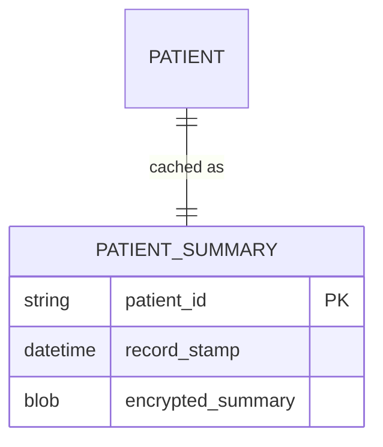
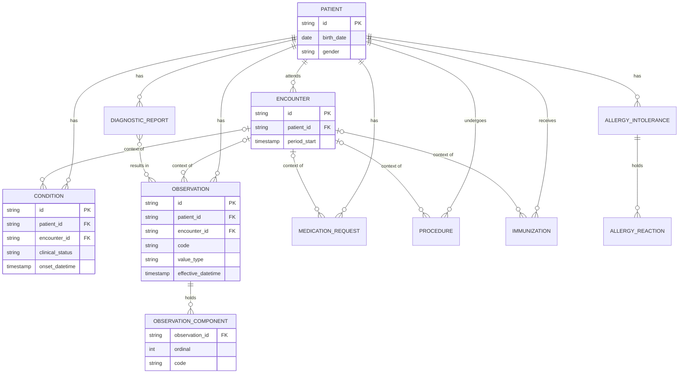
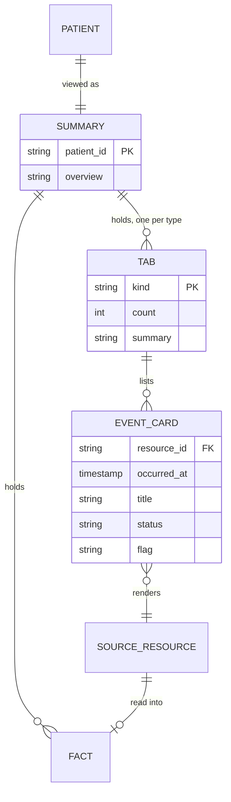

# Data Model — Patient Summary

| Date       | Finder     | Derived from |
|------------|------------|--------------|
| 2026-09-23 | Ming.Huang | the taxonomy and the 5-patient sample in `_docs/fhir_sample_data/` |

Three schemas and the enum sets, kept apart because they have different lifetimes.

| Schema | Lives | Owned by us |
|---|---|---|
| **DB** | our storage | yes |
| **3rd party API** | the FHIR server. mirrored on Redis for a bounded time, never owned | no |
| **Client** | the browser, per page load | yes |

Names come from `000__taxonomy.md`. Where FHIR has a name, we use FHIR's, never our own.

## DB schema

**One table.** The application reads a record and writes a summary; it stores nothing else. No
resource table is mirrored, because nothing needs the raw record twice.



`PATIENT` is drawn for the relationship only. It is **not our table** - it lives in the 3rd party API,
and `patient_id` is a foreign key to something we do not own. That is the whole of our DB schema, and
it is why the 1:1 is the only 1:1 in the model.

| Column | Why |
|---|---|
| `patient_id` | the key's first half |
| `record_stamp` | the key's second half. The newest `meta.lastUpdated` in the record, so freshness is a value comparison rather than a clock |
| `encrypted_summary` | the derived artifact. Prose, facts and sources, encrypted at rest |

## 3rd party API data

### The structure we read

Only the resources the summary and the event stream need. The API returns more, and the rest is
filtered at the boundary.



### Evidence from the sample

Five patients, 1564 resources. The shapes below are measured, not assumed.

| Edge | Cardinality | In the sample |
|---|---|---|
| Patient → each clinical resource | 1 : * | conditions 3 to 13 per patient, observations 94 to 365 |
| Encounter → its children | **0..1 : *** by spec | 45/45, 861/861, 40/40, 72/72, 59/59 carry one. **Always present here**, optional by spec |
| Observation → Component | 1 : * | 98 components over 861 observations. Exactly the 49 observations with a component have **no** `value[x]` - the two are alternatives, never both |
| DiagnosticReport ↔ Observation | **\* : \*** | 507 links, all resolving. Realised as a link table, `diagnostic_report_result` |
| AllergyIntolerance → Reaction | 1 : * | **0 rows**, against 1 allergy. Modelled, never populated |

### Deliberately not read

Present in the API, excluded at the boundary. Billing is not incidental: it runs **34 to 76 rows per
patient**, comparable to every clinical type except Observation.

| Resource | Why not |
|---|---|
| `Claim`, `ExplanationOfBenefit` | billing. 76 of 554 resources for patient 1643, interleaved by date |
| `CarePlan`, `Goal`, `CareTeam`, `Device`, `ServiceRequest`, `DocumentReference` | no use in a summary or an event stream |

The filter is a **whitelist of clinical types**, not a blacklist of the two seen here. Both `$everything`
and a per-type fetch return whatever exists.

### Mirroring it on Redis

The record is fetched, mirrored, and held for a bounded time, so paging the event stream does not
re-fetch it. This is a **mirror, not a second source of truth**: it is disposable, and losing it costs
one fetch. It is also **not** the summary cache - that lives in our DB, keyed by the stamp.

#### Keys, under one identifier

```text
patient:{id}                        the main identifier. everything below hangs off it
|
+-- :meta                           the patient, and the mirror's own state
|     stamp            newest meta.lastUpdated seen
|     fetched_at       when the mirror was written
|     patient          the Patient resource itself. one row, so not its own hash
|
+-- :{Type}                         one hash per resource type. field = resource id, value = JSON
|   |-- :Condition
|   |-- :Observation
|   |-- :MedicationRequest
|   |-- :AllergyIntolerance
|   |-- :Encounter
|   |-- :Procedure
|   |-- :Immunization
|   +-- :DiagnosticReport
|
+-- :timeline                       sorted set. member = {Type}:{rid}, score = occurred_at
```

`{Type}` is a `resource_type` value, minus `Patient`. See the enum list at the end of this document for
the eight literal values - they are not repeated here, so the two lists cannot drift.

**Eight resource types** hang off the patient id. That is the nine resource types we read, less
`Patient` itself - which is the identifier rather than a child of it, so the patient's own row lives in
`:meta` instead of in a hash keyed by the id you already have.

The ERD draws **eleven** entities, not nine. The other two are `OBSERVATION_COMPONENT` and
`ALLERGY_REACTION`: embedded arrays inside their parent resource. They are not children of the patient
and get no key - they travel with the `Observation` or `AllergyIntolerance` field that contains them.

For patient 1643 that is **ten keys**, and a hash field is one resource:

```text
patient:1643:meta                stamp, fetched_at, the Patient row
patient:1643:Condition           9 fields
patient:1643:Observation         365 fields
patient:1643:MedicationRequest   12 fields
patient:1643:AllergyIntolerance  none. a type with no rows gets no hash
patient:1643:Encounter           32 fields
patient:1643:Procedure           11 fields
patient:1643:Immunization        11 fields
patient:1643:DiagnosticReport    33 fields
patient:1643:timeline            473 members
```

```text
HSET patient:1643:Observation 2201 '{"resourceType":"Observation","id":"2201",...}'
HSET patient:1643:Observation 2178 '{...}'
ZADD patient:1643:timeline 1117051718 "Observation:2201"
```

**One hash per resource type, not per resource.** The change probe is per type, so invalidation is per
type, and the two line up. A key per resource would need a per-resource probe the API does not offer.

**No separate index of ids.** A Redis hash's field names already are the ids, so `HKEYS` lists them
without a scan. An id index beside the hash would be a second thing to keep in step, for nothing.

**Ties are the norm, not the exception.** Those 473 events fall on **32 distinct instants**, and the
largest instant holds **51 of them** - Synthea writes an encounter and all its results at one timestamp.
Redis orders equal scores lexicographically by member, so `DiagnosticReport:2202` sorts before
`Observation:2201` before `Procedure:1722`: alphabetical by type, which is not clinical order. If the
stream has to be deterministic inside an instant, the member needs a rank - `{rank}:{Type}:{rid}`,
where the rank is the reading order (the encounter, then its results, then the orders that follow).

**Every type carries a date, but one type does not carry the one you expect.** `Procedure.performed[x]`
is a Period in this data: 0 of 72 have `performedDateTime`, and all 72 have `performedPeriod.start`.
A timeline that reads only the dateTime variant sorts every procedure to the end, silently.

#### Timeouts

The TTL is a **retention bound, not a freshness bound**. Freshness is the probe's job and the probe
runs on every request, so a mirror is only ever served behind one - and a mirror that has just been
probed is exact, not approximate.

| table_name | timeout_definition | when_to_remove |
|---|---|---|
| `patient:{id}:meta` | 15 min from `fetched_at` | on TTL, or rewritten when the summary is rebuilt |
| `patient:{id}:{Type}` | 15 min from the write | on TTL, or **deleted for that one type** when the change probe reports a write after `stamp` |
| `patient:{id}:timeline` | 15 min | on TTL, or with any type hash, since it is built from all of them |
| `patient:{id}:*` | - | when a patient's stored data is withdrawn. one `SCAN` plus `DEL` |

**Why 15 minutes and not 24 hours.** The window only has to cover one clinician paging one patient, and
a second clinician opening the same patient while the first is still reading. Minutes cover that. The
extra hours buy no correctness - the probe has already guaranteed that - they buy more PHI sitting in
Redis, which is the wrong side of a data-minimisation review.

**The constraint this rests on:** the mirror is only safe to serve inside a request that has run the
probe. Every path does that today. A future background job or pre-render that read the mirror *without*
probing would make the TTL load-bearing, and it would then have to be short enough to act as a
correctness bound - which minutes are not. That path would need a different design, not a smaller number.

#### What it buys

Patient 1643 has 478 clinical events. The event stream pages them, and without a mirror every page turn
is another paginated read of the whole record - 4 pages of 100 for the observations alone. With the
mirror it is one read per patient per session.

If the prototype ships without an event stream, drop the mirror. The summary page needs one fetch, and
a single fetch needs no cache.

## Client schema

What the page adds. Two rules: a model that exists elsewhere keeps its **exact field names**, so the
rendering can be generated rather than written twice; and nothing server-side reaches the browser.



**Eight tabs, always** - one per `event_kind`, the empty ones included. `count` is zero for a type with
no rows and the tab renders inert. A tab set derived from the data would shift between patients, and the
reader's positional habit would break on the first patient with no allergies.

### Extra fields, and why each exists

| Field | On | Why the server has no equivalent |
|---|---|---|
| `overview` | SUMMARY | the model's synthesis of the eight one-liners with the patient's base info. Stored inside the ciphertext, not a column |
| `summary` | TAB | the model's one line for that type. Same place |
| `count` | TAB | derived: the rows in the tab. 365 for Observations, 0 for Allergies |
| `flag` | EVENT_CARD | **computed against a local table.** The API populates `interpretation` nowhere in this data |
| `title`, `status` | EVENT_CARD | the rendered strings |

### Excluded from the client

| Field | Why it must not reach the browser |
|---|---|
| `encrypted_summary` | ciphertext. Nothing client-side can use it |
| `record_stamp` | the cache key's second half. The page has no use, and it exposes when the record last changed |
| the raw resource JSON | PHI, and volume the page never reads |

`SOURCE_RESOURCE` is a stand-in. An event card renders one of the eight `event_kind` types. Mermaid's
crow's foot has no polymorphic edge, so the diagram names the abstraction - and the concrete type is
`TAB.kind`, which a row inherits from the tab it sits in.

## Enums

Free text invites typos and silent mismatches. These are the sets worth locking. Most are FHIR's own
value sets, and we handle a subset.

### From the API

| Element | Handled | Excluded |
|---|---|---|
| `Observation.status` | `final`, `amended`, `corrected` | `entered-in-error`, `cancelled`, `preliminary`, `registered`, `unknown` |
| `Observation.category` | `laboratory`, `vital-signs`, `survey`, `exam`, `procedure` | `social-history`, `imaging`, `therapy`, `activity` |
| `Condition.clinicalStatus` | `active`, `recurrence`, `relapse` | `inactive`, `remission`, `resolved` shown separately, never dropped |
| `Condition.verificationStatus` | `confirmed`, `provisional`, `unconfirmed` | `refuted`, `entered-in-error` |
| `Condition.category` | `problem-list-item` | `encounter-diagnosis`. Absent on every condition in this data |
| `MedicationRequest.status` | `active` | `stopped`, `completed`, `cancelled`, `entered-in-error`, `draft`, `on-hold`, `unknown` |
| `MedicationRequest.intent` | `order`, `original-order` | `proposal`, `plan`, `option` and the filler variants. A plan is not a prescription |
| `AllergyIntolerance.criticality` | `low`, `high`, `unable-to-assess` | - |
| `AllergyIntolerance.clinicalStatus` | `active` | `inactive`, `resolved` |
| `AllergyIntolerance.verificationStatus` | `confirmed` | `unconfirmed`, `refuted`, `entered-in-error` |
| `AllergyIntolerance.category` | `food`, `medication`, `environment`, `biologic` | - |
| `reaction.severity` | `mild`, `moderate`, `severe` | - |

### Ours

| Enum | Values | Note |
|---|---|---|
| `value_type` | `Quantity`, `CodeableConcept`, `String`, `Boolean`, `Integer`, `Range`, `Ratio`, `SampledData`, `Time`, `DateTime`, `Period`, `Absent` | FHIR allows eleven in `value[x]`. This data uses two, plus components |
| `flag` | `high`, `low`, `normal`, `unknown` | computed. A stand-in for `interpretation` |
| `event_kind` | `Condition`, `Observation`, `MedicationRequest`, `AllergyIntolerance`, `Encounter`, `Procedure`, `Immunization`, `DiagnosticReport` | the eight that can appear as an event, **and the eight tabs**. `Patient` is excluded: it is the page's subject, not an entry on it |
| `resource_type` | the same eight, plus `Patient` | every type we read. `fact.source_type` needs all nine, because age and sex come from the patient |
